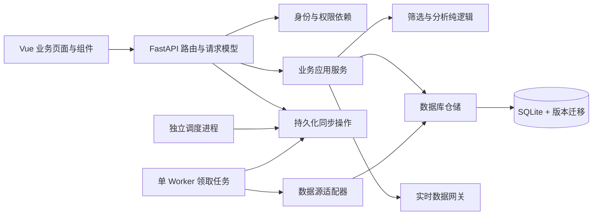

# 市场数据平台整改意见与目标设计

日期：2026-09-09  
基线：Git `23ad995`（本次审查开始时无已跟踪文件改动）  
适用对象：内部团队日常使用；优先稳定性、结果可信度和操作效率。  
文档性质：供产品负责人评审、开发人员实施的建议基线，不代表下述功能已实现。配套文件：[开发实施计划](2026-09-09-remediation-plan.md)。

## 1. 先列具体缺陷，再作目标裁决

本次是用户指定的全项目整改评估，没有指定 PR diff，因此以当前版本实现作为审查范围；历史说明和代码注释不作为正确性的证据。下表定位均对应上述基线，后续代码调整后以问题编号追踪。

优先级：P1＝影响核心结果、共享数据或主要操作，应先修复；P2＝影响效率、可维护性或特定部署场景，在对应迭代解决。没有生产影响数据，不虚构 P0 事故。

| ID / 优先级 | 具体缺陷及触发反例 | 证据 | 整改裁决与验收锚点 |
|---|---|---|---|
| F01 / P1 | 评级参数协议不一致。仅选 AAA，Axios 默认生成 `ratings[]=AAA`，后端读取 `ratings` 字符串；选择条件可能退化成不限评级。 | `frontend/src/pages/Bonds.vue:74`、`frontend/src/api/index.js:34`、`backend/api/routes/cb_screen.py:152`、`:175`；本次执行 Axios `getUri` 已复现序列化结果。 | 前后端使用同一协议；QA-01 验证只有 AAA 被返回。 |
| F02 / P1 | 新增指数后每 3 秒 POST 同步接口，运行时返回 busy、完成后再次 started，不会靠成功终态停止，可能循环重启采集。 | `frontend/src/pages/DataStatus.vue:157`、`:162`、`:164`、`:344`；`backend/api/routes/data_management.py:271`、`:291`、`:342`。 | 创建任务与查询任务分离；QA-02 证明一次点击最多创建一次运行。 |
| F03 / P1 | 因子筛选进入 loading 时把结果置 null，结果卡仍渲染，排除明细直接访问 `previewResult.excluded_rows`。可在响应前触发渲染异常。 | `frontend/src/pages/Factors.vue:121`、`:122`、`:432`、`:478`。 | 结果组件只在有结果时挂载，loading 独立；QA-03。 |
| F04 / P1 | 策略设置目标 10 只但仅 3 只符合时，后端 `top_n` 仍返回 10，前端显示“10 只入选”，把目标当实际结果。 | `backend/services/cb_screen.py:310`、`:356`；`frontend/src/pages/Factors.vue:438`。 | 分离 target_count 与 selected_count；QA-04。 |
| F05 / P1 | 非法数值静默改变条件：`abc` 被丢弃，`120abc` 被当成 120；上下限倒置没有表单错误。 | `frontend/src/pages/Bonds.vue:69`—`:79`；`backend/api/routes/cb_screen.py:145`—`:175`。本次 Node 执行验证上述解析行为。 | 严格有限数字及区间校验，错误时不发请求；QA-05。 |
| F06 / P1 | 共享配置、黑名单、指数启停、采集触发没有应用层身份与操作权限检查；能访问服务的人可改变团队结果。是否已有外部网关保护未验证。 | `backend/main.py:46`—`:64`；`backend/api/routes/app_settings.py:25`；`backend/api/routes/cb_screen.py:52`、`:207`、`:221`；`backend/api/routes/data_management.py:297`。 | 内部部署也要有身份、服务端角色校验和审计；QA-10。 |
| F07 / P1 | 策略全量覆盖写 JSON，无版本冲突检测；两人先后保存可覆盖对方修改。直接 `open(..., 'w')` 期间中断还可能留下损坏文件，读取时静默回默认策略。 | `frontend/src/pages/Factors.vue:101`；`backend/services/cb_factors.py:165`—`:183`。 | 事务持久化、版本号和 409 冲突响应；损坏配置显式报错；QA-11。 |
| F08 / P1 | 指数名单的读锁与写锁分离，不保护路由完整读改写过程；同时新增 A/B 时后写覆盖前写。已有数据集绑定还可被重新添加覆盖来源，与用户“补充数据”的预期不符。 | `backend/api/routes/data_management.py:237`、`:248`、`:255`、`:264`；`backend/services/index_universe.py:154`—`:171`。 | 数据库唯一键、事务更新；换源独立操作，禁止添加隐式换源；QA-12。 |
| F09 / P1 | 设置页取消按钮绑定 `onCancel`，脚本未定义；读取失败仅 finally 结束 loading，没有错误状态，字段标签依赖失败的返回值。 | `frontend/src/pages/Settings.vue:23`—`:36`、`:144`、`:177`。本次无后端环境实见无名称输入框和可点击保存按钮。 | 加载失败禁写；标签使用本地定义；取消恢复已保存状态；QA-06。 |
| F10 / P1 | 任务轮询读取 runs，却判断另一个未刷新的 jobs；有可能提前结束或持续转圈。同步结果聚合把全部 failed 的非空数组也转成 busy。 | `frontend/src/pages/DataStatus.vue:195`—`:205`；`backend/api/routes/data_management.py:293`。 | 同一个 run_id、单一状态来源；完整覆盖状态归并；QA-02。 |
| F11 / P2 | 更改筛选后旧结果仍显示，失败后仅 toast，未明确旧结果对应哪组条件；用户可能把旧结果当本次结果。 | `frontend/src/pages/Bonds.vue:85`—`:94`、`:289`；`frontend/src/pages/Factors.vue:125`、`:448`。 | 草稿与已应用条件分离，结果绑定参数快照，旧结果持续标识；QA-07。 |
| F12 / P2 | 估值列表以首行日期作为全页更新日期，合并股息与股债指标时未保留其独立日期，混合新旧数据无法辨认。 | `frontend/src/pages/ValuationList.vue:48`—`:64`。 | 每个指标带来源、观察日期和抓取时间；QA-08。 |
| F13 / P2 | 估值三项请求 Promise.all 任一失败就清空主结果，股息异常也导致可用 PE/PB 不显示。 | `frontend/src/pages/ValuationList.vue:28`、`:67`；`frontend/src/pages/ValuationDetail.vue:53`、`:68`。 | 各指标独立状态，局部失败局部重试；QA-08。 |
| F14 / P2 | 路由从某指数详情切到另一个同组件详情时，没有监听 code 变化；组件复用会导致地址变化而数据仍旧。 | `frontend/src/pages/ValuationDetail.vue:16`、`:180`；`frontend/src/layouts/AppLayout.vue:97`；`frontend/src/router/index.js:33`。 | watch code 并取消旧请求；同组件导航回归，QA-08。 |
| F15 / P2 | CORS 仅放行 GET/POST，但前端实际有 PUT、PATCH、DELETE。浏览器跨源直连 API 时预检会阻止保存、启停和恢复；同源代理部署不受此项影响。 | `backend/main.py:51`；`frontend/src/api/index.js:44`、`:99`；`frontend/src/api/dataManagement.js:28`。 | 按受信来源放行真实方法；测试跨源预检，不把 CORS 当鉴权；QA-10。 |
| F16 / P2 | 调度跟随每个 Web 进程启动，任务互斥仅进程内 set。多 worker 部署可重复执行，单进程部署暂不触发。 | `backend/main.py:24`—`:30`；`backend/services/run_logger.py:18`—`:31`。 | 第一阶段固定单实例；后续独立 worker + 数据库租约；QA-13。 |
| F17 / P2 | 初始化只有 create_all，没有现有数据库结构升级路径；部署新列后不能靠启动自动变更旧表。 | `backend/models/database.py:42`—`:47`；`requirements.txt:1`。 | 引入有版本的迁移，已有库与新库均验收；QA-14。 |
| F18 / P2 | 菜单叫“数据管理”、页头叫“数据状态”；设置页重复标题。筛选表单桌面限定 640px 且竖排，列表前置空白较多。 | `frontend/src/layouts/AppLayout.vue:30`；`frontend/src/router/index.js:48`；`frontend/src/pages/Settings.vue:83`；`frontend/src/pages/Bonds.vue:416`；本次桌面实见。 | 单一导航定义与标题；桌面紧凑筛选区、移动端抽屉；QA-09。 |
| F19 / P2 | README 仍声明 React/Phase 1，实际为 Vue 且已有多模块；启动说明 8000，Vite 代理 8001。新人照说明启动可能无法联调。 | `README.md:3`、`:24`、`:49`；`frontend/package.json:20`；`frontend/vite.config.js:11`。 | 唯一启动方式、锁定环境、可复现检查；QA-15。 |
| F20 / P2 | 核心页面同时承担表单、请求、业务规则、状态、弹窗和展示；改接口容易同时改多个页面，现有测试只覆盖少数前端工具。 | `frontend/src/pages/Factors.vue:26`、`:98`、`:173`、`:242`；`frontend/src/pages/DataStatus.vue:95`、`:157`、`:305`；`frontend/package.json:6`—`:10`。 | 按业务模块抽 composable 和组件，新增关键流程组件/API/E2E 测试；QA-16。 |

**目标裁决：不达标。** 以“内部团队可以每日依赖、准确理解筛选结果、共享修改不互相覆盖、采集故障可追踪”为目标，F01/F04 偏离结果正确性，F02/F10 偏离任务可控性，F06/F07/F08 偏离团队协作边界，F09/F11/F12 偏离交互可信度。不以界面审美或作者资历判定完成度，不给没有需求分母支撑的完成百分比。

## 2. 审查边界和已验证结果

审查对象包含 7 个页面、路由/布局/API 客户端、后端入口/接口/任务运行器、筛选与配置服务、数据模型、测试目录及构建配置。不是所有抓取器与数值算法的逐行正确性审计。

| 检查 | 结果及限制 |
|---|---|
| 前端构建 `pnpm build` | 成功；Vite 输出 2254 modules。只能证明可构建，不证明页面事件和业务正确。 |
| Node 工具测试 | `requestGuard.test.mjs` 和 `dataManagementView.test.mjs` 共 14 项通过。未覆盖 F01/F02/F03/F04。 |
| Axios 参数与数值解析 | 实际输出 `ratings%5B%5D=AAA&ratings%5B%5D=AA%2B`；`parseFloat('120abc')` 为 120。 |
| 浏览器 | 1280×720 查看筛选初始页、设置失败页、数据管理失败页；设置字段名消失、重复标题、英文错误已观察。未查看正常真实数据图表，不把失败状态截图等同于全产品视觉评测。 |
| 后端测试 | 未执行。PATH 的 python 指向 Python 2.7；另一个可用 Python 3.12.14 环境缺少 FastAPI。没有据此判定后端测试失败。 |
| 外部数据和线上环境 | 未发起真实同步、邮件、黑名单改动；没有测线上性能、多人并发与数据源可用性。 |

F02/F03/F04/F07/F08/F10/F14/F16 的反例由控制流推导，需开发按 QA 用例完成运行回归；不声称已在生产复现。保留既有测试作为回归资产，包括 `tests/test_task_transactions.py`、`tests/test_scheduler_recovery.py`、`tests/test_style_rotation_analysis.py`。

## 3. 改造策略与边界

| 路线 | 成本与结果 | 选择 |
|---|---|---|
| 原技术栈渐进重构 | 先消除核心错误，再重构边界；旧接口可过渡，业务不中断，但需要短期适配层。 | **采用。** 与内部日常使用目标一致。 |
| 仅修 UI 与局部 bug | 最快见到页面变化，但共享配置、运行记录和数据契约问题继续存在。 | 只适合作为第一批止血工作，不作为终点。 |
| 推倒重写/微服务化 | 会重做数据抓取、历史兼容、算法和运维；当前缺乏足够测试保护迁移。 | 本轮不采用。 |

保留 Vue 3、Element Plus、ECharts、FastAPI、SQLAlchemy。第一轮保留 SQLite、单机部署；改为模块化单体。采用 Alembic 做结构迁移，其用途是管理 SQLAlchemy 数据库版本变更，参见[官方迁移教程](https://alembic.sqlalchemy.org/en/latest/tutorial.html)。新增 TypeScript 只从改造模块和接口类型开始，不要求一轮改完所有 JS。

范围默认：一个团队工作空间、桌面优先，移动端覆盖查看与基本查询；团队共享模板和排除名单，个人浏览器保留筛选草稿。新增工作台放在核心流程稳定之后。

本轮不加入自动交易、真实持仓管理、回测、个性化投顾、多租户计费、可视化策略编程、数据源插件市场。现有“容差保留”改称“排名缓冲区”，因为代码只判断排名，没有真实持仓输入：`backend/services/cb_screen.py:321`。以后要做持仓建议必须另立业务需求。

## 4. 角色与信息架构

角色是本次建议的最低权限划分，不表示系统已经接入企业身份平台。

| 能力 | 浏览者 viewer | 分析员 analyst | 管理员 admin |
|---|---|---|---|
| 查看已保存结果、估值、轮动、数据新鲜度 | 是 | 是 | 是 |
| 执行实时查询/策略预览，保存团队模板，改团队排除名单 | 否 | 是 | 是 |
| 添加/启停指数、切换来源、手动采集、查看详细任务错误 | 否 | 否 | 是 |
| 修改系统配置、发送测试邮件 | 否 | 否 | 是 |

任何写操作在 API 校验权限；隐藏菜单只是展示规则。审计记录包含操作者、操作对象、前后版本、时间、结果、request_id，敏感值只记录“已更新”。默认单团队，不把任意用户传入的角色头当可信身份。

```text
工作台（M4 后置）       数据概况、最近使用的筛选方案、失败任务摘要
转债研究
  快速筛选             常用条件 → 结果 → 单债详情抽屉
  策略模板             模板列表 → 编辑 → 预览 → 保存 → 设为默认
  团队排除名单         统一的代码、原因、操作者、恢复入口
市场分析
  指数估值             搜索/排序列表 → 指数详情 → 指标说明
  风格对比             选择对照与时间 → 查看收益差及估值
数据运维（管理员）
  数据目录             指数/数据集覆盖、新鲜度、订阅状态
  任务运行             本次运行、子项状态、失败重试
系统设置（管理员）     数据源凭据配置状态、通知配置
```

迁移期间保留旧 URL；`/cb-list` 仍直接可用，`/factors` 显示新名称“策略模板”，`/status` 进入数据目录并显示明确标题。不要先改地址再迁移页面。导航、标题、角色配置来自一份 route meta 定义，未知地址有返回入口。

## 5. 四条核心用户路径

### 5.1 快速筛选：用户能知道自己查了什么、看到的是哪一次结果

1. 打开页面恢复上次已应用条件；未查询时显示“设置条件后查询”，不暗示数据库为空。
2. 桌面常用字段为评级、价格区间、转股溢价率；年限、规模等收进“更多条件”。保留当前默认值，但用可移除标签明确显示“价格≤120、溢价率≤30”。
3. 评级选择包含显式“不限（当前支持评级范围内）”；未选任何项采用“不限”这一明确规则，前后端保持一致，非法评级返回 422。
4. 输入校验就地显示。例如“最高价必须不小于最低价”；空值代表不限制，零是有效值，拒绝 NaN/Infinity/混入文字。输入不合法不查询，也不覆盖上次已应用条件。
5. 点击“查询”，按钮进入 loading；结果区可保留上次结果，但顶部持续显示“正在刷新，以下为上次结果”。请求发出时冻结 submittedFilters。
6. 成功后原子替换结果与 appliedFilters、时间、来源；后发请求优先。失败显示持久错误条和“重试”，旧结果明确带“上次成功结果”。
7. 结果区显示数据批次、行情观察时间、抓取时间、适用评级范围、符合数量、排除数量、排序字段。没有可信交易日期时显示“行情日期未提供”，不把抓取时间当交易时间。
8. 单债点击名称打开详情抽屉；展示已获得的字段及解释，不为详情默认触发新抓取。历史可作为后置区域按需加载。
9. “拉黑”改为“加入团队排除名单”，对话框说明影响全部团队查询，填写原因；成功后计数同步更新。恢复后重新计算当前已应用条件下的结果，不把整市场数据直接插入当前列表。

结果字段现有 `ytm_simple` 保留兼容值，但 UI 改为“到期价差回报（未年化）”，并展示现有计算式与未涵盖因素；与数据源的 `ytm_rt` 分列命名，禁止一个“到期收益率”标签表达两种字段。这里只统一软件字段语义，不另行设计收益率模型。依据：`frontend/src/pages/Bonds.vue:284`、`:329`，`backend/services/cb_screen.py:332`。

### 5.2 策略模板：编辑、预览、保存、设为默认四种动作分清

左侧模板列表显示默认标记和更新时间；右侧分“基础条件、排除规则、评分规则、候选数量与缓冲区”。字段帮助解释排序方向、权重与排除原因。

编辑产生独立草稿，不直接修改服务端版本；离开有未保存内容时可“继续编辑 / 放弃修改”。切换模板不丢掉其他草稿；刷新前有浏览器离开提示。失败保留草稿。

“预览草稿”永远不保存、不设默认；结果显示“未保存草稿”或“模板 vN”，并绑定具体参数哈希。编辑参数后旧预览标为“参数已修改，需要重新预览”。“保存”成功后产生新版本；“设为默认”是单独持久化动作，对未保存草稿先引导保存。

结果标题显示“目标 10 只 / 实际 3 只 / 排名缓冲区 0 只”。评分明细展示原始值、方向、名次分、权重与贡献；被排除明细逐条显示原因。统一的团队排除名单先执行，再执行模板内额外排除，去重计数。F07/F11 和 `backend/api/routes/cb_screen.py:119`、`:182` 是该流程改造的依据。

### 5.3 市场分析：数据可比较、缺失可识别

列表默认保留现有 5 年分位口径，标题和列名写明窗口；排序支持缺失值沉底。每行展示指数与数据日期，过期日期明确标记。股息、估值、债券基准日期不同则分别标注，不用一个全页“更新于”替代。

详情顶部为指数名/代码、数据状态、当前指标；下面是“PE / PB / 股息率 / 股债对比”，指标区独立 loading/error。请求只取当前标的和时间窗口，切 tab 缓存命中时复用，用户主动刷新可跳过缓存。

风格对比采用“选择对照 → 选择区间 → 应用”的明确节奏；短暂输入不触发所有历史接口。结果展示已应用对照、有效区间、样本数、计算窗口；参数草稿变化不改变旧图标题。相同日期联动已有实现应回归保留，不重复重写算法。

缺失图点用断点表示，不能填 0；独立时间序列按日期对齐，缺失不偷偷前值填充。样本不足显示实际起止与样本数；禁用不存在的能力并说明原因。路由参数变化必须重新读取数据，Vue Router 会复用同一路由组件，参见[官方动态路由说明](https://router.vuejs.org/guide/essentials/dynamic-matching.html)。

### 5.4 数据运维：订阅保存与数据到位是两件事

添加指数分三步：输入代码 → 检查支持的数据与来源 → 确认订阅。已存在绑定不允许在“添加”中更换来源。探测失败与不支持分开；令牌过期保留输入、重新检查。

保存返回订阅状态和 operation_id。UI 显示“已加入，等待同步”，跳到本次任务记录；只 GET 查询进度。重新打开页面仍可按 operation_id 找到运行，不靠浏览器内变量记忆。

任务状态固定为 queued/running/success/partial/failed/interrupted/skipped。每次操作可包含多个任务，每个任务包含多个指数数据集子项；聚合规则见实施计划。正常完成停止轮询；轮询超时显示“仍在执行”，不把它判为失败，也不重新 POST。

列表“暂停更新”只停止未来采集，保留历史并标注“已暂停”；默认分析列表可隐藏暂停订阅，旧详情 URL 仍可查看历史。同步目标精确到当前指数和数据集；过渡期如仍触发全来源任务，提交前显示真实影响范围。

设置页在取得配置前禁写；字段名来自静态元数据。“取消”还原服务端状态；测试邮件仅使用已保存配置，草稿存在时禁用并写“先保存配置再测试”。凭据留空保持、不回显；“移除凭据”必须是独立显式动作，不能把空白输入当删除。

## 6. 页面规格与通用交互

以下是待实施线框，不是现有页面截图。

```text
┌ 导航 208px ┬ 转债筛选                 [数据状态] [帮助] ┐
│ 转债研究   │ 评级 [多选]  价格 [从][至]  溢价率 [上限]   │
│ 市场分析   │ [更多条件] 条件标签…        [重置] [查询]   │
│ 数据运维   ├ 已应用条件 · 数据时间 · 来源 · 质量提醒       │
│ 系统设置   ├ 结果数量  [搜索名称/代码] [列设置]            │
│            │ 名称/代码 | 现价 | 溢价率 | 回报 | 风险 | … │
│            │ 点击名称打开详情抽屉；表头保持可见           │
└────────────┴───────────────────────────────────────────┘
```

| 规范 | 实施要求 | 对应问题 |
|---|---|---|
| 布局 | 1280/1440 桌面常用条件 2 行内，表格进入首屏；768～1199 两列条件；小于 768 筛选抽屉+结果卡片，表格为可切换视图。 | F18 |
| 样式 | 一个 design token 文件控制色彩/间距/圆角；间距 4/8/12/16/24，正文 14px，辅助不小于 12px。通用按钮高度 32/36，触屏主操作热区至少 44px。 | F18/F20 |
| 颜色 | 涨跌使用现有红涨绿跌惯例，并保留正负号；运行状态使用状态图标+文字；正收益不等价“数据成功”。 | `Bonds.vue:321`、`:333` |
| 组件 | 统一 PageHeader、DataState、DataFreshness、FilterSummary、ConfirmAction、MetricValue、TaskStatusBadge；表单统一 Element Plus。 | F09/F18/F20 |
| 数据展示 | null 用“—”且可解释原因；0 必须显示；比例、亿元、倍数由字段定义格式化；不在各页面手写不同格式。 | F12/F20 |
| 错误 | 用户看到“行情服务暂不可用，可重试”与 request_id；技术异常在管理员详情和服务端日志；不让 toast 成为唯一错误证据。 | F09/F11/F13 |
| 键盘 | 所有操作用 button/link；输入有 label/for；抽屉支持 Esc、焦点圈定与关闭后回到触发点；收起菜单有名称提示。 | `AppLayout.vue:83`、`:93`，`Settings.vue:143` |
| 页面状态 | idle、loading、success、empty、error、stale、partial 有显式展示规则；无查询、无数据、无匹配结果不得复用同一空状态。 | F03/F09/F11/F13 |

## 7. 目标模块架构



采用这一边界是针对 F07/F08/F16/F20 的建议：HTTP 路由不启动裸线程、不直接写 JSON、不包含多数据源采集编排；页面不直接计算业务结论、不混用草稿与已保存配置。

| 模块 | 负责 | 不负责/依赖规则 |
|---|---|---|
| bonds | 快速过滤、策略、评分解释、团队排除 | 纯规则不依赖 HTTP/数据库；由应用服务提供 Snapshot 输入。 |
| market | 估值读取、序列对齐、风格分析 | 不在读接口抓取历史，不擅自改变现有算法口径。 |
| ingestion | 订阅、探测、采集任务、数据集新鲜度 | 不直接驱动前端；状态通过持久化 operation/run 暴露。 |
| settings/access | 配置、凭据引用、身份角色、审计 | 不返回凭据明文；业务模块只读取所需配置。 |
| shared | 数据库、时钟、错误协议、日志、通用数据模型 | 不建“大而全 utils”；业务代码不能反向塞入 shared。 |

前端按 `features/bonds`、`features/strategies`、`features/market`、`features/data-management`、`features/settings` 聚合页面、api、composables 和测试；`components/common` 放展示组件。旧页面文件暂作薄壳，避免一开始全量搬文件造成难审 diff。

后端先建立 schemas、application、repositories 和 worker，复用已有 services/queries 与算法函数；按实际修改逐步迁入业务目录，禁止为目录整洁先大规模移动。每个 PR 同时包含行为测试和调用方迁移。

## 8. 数据契约与持久化原则

每次查询返回 result_id、applied_parameters、source、observed_at（可空）、fetched_at、quality、warnings、definition_version。交易日是日期，系统时间带 `+08:00` 或 UTC 偏移；禁止仅返回 HH:mm:ss 冒充完整时间。每个估值指标保留自身 observed_at。

quality 固定 fresh/stale/partial/unavailable/unknown：fresh 必须基于交易日历及数据源发布时间表判断；缺失日历或时间时为 unknown，不能按周一到周五简单推断节假日。截止时间放入数据集策略配置，初次导入依据现有任务配置并由数据管理员验收。此项是新契约，未验证当前数据源能完整提供时间元数据。

团队配置迁入数据库：StrategyTemplate、StrategyVersion、IndexSubscription、DatasetBinding、AuditEvent。StrategyVersion 保存不可变规则 JSON 和规则版本；IndexSubscription.code 唯一；DatasetBinding 对 subscription_id+dataset 唯一；保存采用 expected_version，冲突返回 409。

任务增加 SyncOperation、TaskRun、TaskRunItem。操作记录用户意图，运行记录执行尝试，子项记录指数/数据集结果；一次重试创建新 run 并关联旧 run，不覆盖历史。现有 TaskRunLog 可作为兼容读取，迁移不能丢历史。

第一阶段 SQLite 单 writer worker；API 写配置仍走短事务。SQLite 锁等待、队列积压需监测。只有在测得持续写竞争或要多主机高可用时，另开 PostgreSQL 迁移，不提前引入 Redis/Celery/Kafka。

备份必须覆盖数据库、尚未迁移的 `data/factors.json` 与 `data/index_universe.json`、配置版本；凭据恢复走受控渠道。已有 `scripts/backup_db.py:51` 使用 SQLite backup API，可扩展，但 `:72` 在备份后分别统计源库与备份，持续写入时计数差异不等于备份损坏；恢复验收必须在隔离库做，不能以脚本一句成功代替恢复演练。

## 9. 交付目标与排期约束

规划假设：2 名开发（前端/后端各 1）+ 产品负责人兼职验收 + QA 支援，单团队约 10 人、20 并发请求的初始容量场景。人数与负载是计划参数，不是已测事实。

先完成 M0 环境基线与 F01～F05/F09 止血；M1 任务状态与共享持久化；M2 两条转债主流程；M3 市场分析与统一界面；M4 工作台和团队试运行。总量估算 39～58 开发人日，另加 8～12 QA 人日，约 6～9 周日历时间（含 20% 集成缓冲，须在 M0 后重估）。

验收目标是建议的发布门槛：核心 P1 为零；固定数据上相同规则结果可复算；一次同步意图不重复执行；共享编辑不静默覆盖；所有主流程有失败恢复入口；配置恢复演练通过。首屏和查询性能目标见 QA-16，未进行性能测量，不报告当前达标。

负责人冻结清单（实施 kickoff 勾选即可，不影响当前整改稿交付）：

- [ ] 接受单团队、共享模板/排除名单、桌面优先范围。
- [ ] 指定身份来源：已有可信反向代理身份，或单独提供 OIDC 集成；不自建密码系统。
- [ ] 指定默认策略调整和排除名单修改的责任角色。
- [ ] 登记每个数据集的预期到达时间、交易日历来源、凭据管理员。
- [ ] 确认开发/QA 人员、试运行用户、停机迁移窗口和备份负责人。

若身份平台尚未具备，M0/M1 可在仅本机或隔离测试环境开发；多人正式使用前必须完成服务端身份边界。CORS 的方法与来源配置遵循 [FastAPI 官方说明](https://fastapi.tiangolo.com/tutorial/cors/)，它解决浏览器跨源策略，不替代身份验证。
