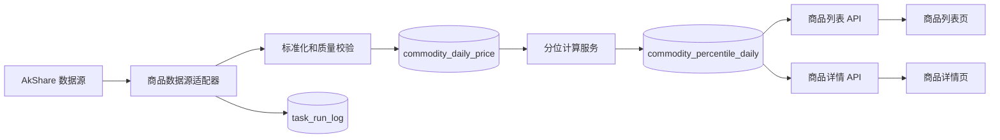

# 商品监控模块接入设计与实施方案

> 状态：待实施
> 目标项目：`D:\gitub_codes\web`
> 参考实现：`D:\gitub_codes\market-daily\src\commodity`
> 页面形态：独立列表页 + 独立详情页
> 数据口径：商品收盘价历史分位，不称为估值分位

## 1. 目标

复用 `market-daily` 商品模块中的数据抓取和多周期价格分位计算能力，在当前系统中形成一条可追踪的数据流水线：

1. 定时抓取约 75 个国内外商品品种。
2. 对历史价格执行幂等增量入库。
3. 统一计算 21 日、63 日、1 年、3 年、5 年、10 年价格分位。
4. 提供商品列表页，支持跨品种比较、筛选和排序。
5. 提供商品详情页，展示价格历史、分位状态和数据质量。
6. 复用当前系统的调度、任务锁、运行日志、手动触发和数据状态能力。

## 2. 明确不做

第一版不实现以下内容：

- 商品交易、持仓或买卖建议。
- 邮件生成、邮件发送、发送记录和消息通知。
- 用户自定义分位窗口和告警阈值。
- 商品品种的前端 CRUD；75 个初始品种由种子数据维护。
- 对十年历史中每个交易日预先回算全部六个分位。
- K 线、技术指标、跨品种相关性和价差策略。
- 将 `market-daily` 作为运行时依赖或直接访问其工作目录。

## 3. 现有实现裁决

结论：现有商品模块对“每日邮件”目标达标，对“系统内增量存储与页面展示”目标部分达标。

需要在接入时解决：

1. `core.py` 每次扫描重新获取完整历史，结果只存在内存，没有持久化、补偿和历史查询能力。
2. `run.py` 将抓取、计算、渲染、发送放在一次执行中，无法分别判断数据任务和通知任务的结果。
3. 商品分类写在 `reporting.py` 展示层，页面若复制这套逻辑会形成重复口径。
4. 网络请求没有单品种超时和有限重试，串行任务可能被单一品种拖住。
5. `skip_if_no_today_data` 使用北京时间当天判断，但内盘与外盘并不共享完全相同的数据发布日期。
6. 当前“极值”实际是最新收盘价在指定历史窗口中的经验分位，应在产品中统一称为“价格分位”。

## 4. 总体架构



边界要求：

- `source` 只负责访问数据源并返回标准结构。
- `store` 只负责数据库幂等写入和查询。
- `calculator` 只负责纯计算，不访问网络、不提交事务。
- `task` 负责编排、失败隔离、重试和运行摘要。
- API 不调用 AkShare；页面请求不能触发远程数据抓取。

## 5. 数据模型

### 5.1 `commodity_instrument`

品种主数据。

| 字段 | 类型 | 约束 | 说明 |
|---|---|---|---|
| `code` | String(16) | PK | 数据源代码，如 `RB0`、`CL` |
| `name` | String(64) | NOT NULL | 中文名称 |
| `market` | String(16) | NOT NULL | `domestic` / `foreign` |
| `category` | String(32) | NOT NULL | 商品分类 |
| `source` | String(32) | NOT NULL | 数据源适配器名称 |
| `enabled` | Boolean | NOT NULL | 是否抓取，默认 true |
| `display_order` | Integer | NOT NULL | 稳定展示顺序 |
| `created_at` | DateTime | NOT NULL | 创建时间 |
| `updated_at` | DateTime | NOT NULL | 更新时间 |

现有 `commodity.yaml` 的 75 个品种通过迁移种子数据一次性导入。分类必须随品种入库，不允许在前端中按代码推断。

### 5.2 `commodity_daily_price`

商品日线价格。

| 字段 | 类型 | 约束 | 说明 |
|---|---|---|---|
| `id` | Integer | PK | 自增主键 |
| `instrument_code` | String(16) | FK, NOT NULL | 商品代码 |
| `trade_date` | Date | NOT NULL | 数据对应日期 |
| `close` | Float | NOT NULL | 收盘价，必须大于 0 |
| `open` | Float | NULL | 数据源提供时保存 |
| `high` | Float | NULL | 数据源提供时保存 |
| `low` | Float | NULL | 数据源提供时保存 |
| `volume` | Float | NULL | 数据源提供时保存 |
| `source` | String(32) | NOT NULL | 数据来源 |
| `ingest_run_id` | Integer | NULL | 对应任务运行 ID |
| `created_at` | DateTime | NOT NULL | 首次入库时间 |
| `updated_at` | DateTime | NOT NULL | 最近修订时间 |

唯一约束：`(instrument_code, trade_date)`。

索引：

- `(instrument_code, trade_date)`，支持详情页时间序列查询。
- `(trade_date)`，支持数据新鲜度统计。

### 5.3 `commodity_percentile_daily`

每日各窗口价格分位快照。

| 字段 | 类型 | 约束 | 说明 |
|---|---|---|---|
| `id` | Integer | PK | 自增主键 |
| `instrument_code` | String(16) | FK, NOT NULL | 商品代码 |
| `trade_date` | Date | NOT NULL | 指标对应的数据日期 |
| `window_code` | String(8) | NOT NULL | `d21/d63/y1/y3/y5/y10` |
| `window_days` | Integer | NOT NULL | 窗口交易日数 |
| `percentile` | Float | NULL | 0～100；样本不足时为空 |
| `sample_count` | Integer | NOT NULL | 实际样本数 |
| `signal` | String(16) | NOT NULL | `high/low/neutral/insufficient` |
| `algorithm_version` | String(16) | NOT NULL | 首版为 `v1` |
| `created_at` | DateTime | NOT NULL | 计算时间 |
| `updated_at` | DateTime | NOT NULL | 重算时间 |

唯一约束：`(instrument_code, trade_date, window_code, algorithm_version)`。

### 5.4 `commodity_sync_state`

每个品种一行，保存抓取运行状态。不能把品种级错误只写进 `TaskRunLog.summary`，因为该字段长度有限，列表页和详情页也需要稳定读取品种状态。

| 字段 | 类型 | 约束 | 说明 |
|---|---|---|---|
| `instrument_code` | String(16) | PK, FK | 商品代码 |
| `last_attempt_at` | DateTime | NULL | 最近尝试时间 |
| `last_success_at` | DateTime | NULL | 最近成功完成时间 |
| `source_latest_date` | Date | NULL | 最近一次源数据最大日期 |
| `status` | String(16) | NOT NULL | `never/success/unchanged/failed/suspicious` |
| `consecutive_failures` | Integer | NOT NULL | 连续失败次数 |
| `last_error` | String(1000) | NULL | 最近失败摘要，成功后清空 |
| `updated_at` | DateTime | NOT NULL | 状态更新时间 |

这张表是运行状态，不保存价格或分位。页面展示的最新价格仍以 `commodity_daily_price` 为准。

## 6. 指标口径

### 6.1 窗口

| 编码 | 交易日数 | 页面文案 |
|---|---:|---|
| `d21` | 21 | 21日 |
| `d63` | 63 | 63日 |
| `y1` | 252 | 1年 |
| `y3` | 756 | 3年 |
| `y5` | 1260 | 5年 |
| `y10` | 2520 | 10年 |

### 6.2 计算公式

```text
价格分位 = 窗口内收盘价小于或等于当前收盘价的样本数
         / 窗口样本总数 × 100
```

计算前必须按 `trade_date` 升序排列，并对日期去重。窗口不足时返回 `null`，不允许用短样本冒充完整窗口。

### 6.3 信号

- `percentile >= 85`：`high`
- `percentile <= 30`：`low`
- 其余：`neutral`
- 样本不足：`insufficient`

页面中的“当前状态”取六个窗口中最强的有效信号：

1. 同时命中多个高位或低位时，优先展示最长窗口，例如“5年高位”。
2. 同时存在高位和低位时，展示“周期分化”，详情页列出具体窗口。
3. 全部中性时展示“中性”。
4. 最新数据过期或本次抓取失败时，数据状态优先于价格信号。

## 7. 增量同步策略

AkShare 当前适配器返回完整历史序列，所以“增量”是数据库写入策略，不强行伪造成只获取最后一天。

### 7.1 触发方式

只有两个入口可以触发同步：

1. APScheduler 定时触发。
2. 数据状态页手动触发。

两个入口必须调用同一个 `run_commodity_daily()`，并复用同一个任务锁。普通商品列表和详情 API 只读数据库，绝不现场访问数据源。

服务启动时只注册任务，不自动抓取。原因是当前项目经常重启，启动即抓取会制造重复流量。空库在下一次 15:50 定时运行时初始化，也可以由用户在数据状态页手动触发一次。

### 7.2 一次任务的执行流程

任务开始时读取全部 `enabled=true` 的品种，按 `display_order` 串行处理。第一版不使用多线程并发访问公共数据源。

每个品种执行：

1. 在无数据库事务的状态下请求数据源，避免网络等待期间持有写锁。
2. 获取完整历史，统一转换日期和数值。
3. 校验结果；校验失败视为该品种失败，不进入写事务。
4. 开启该品种自己的数据库事务。
5. 按 `(instrument_code, trade_date)` 比较源数据和数据库。
6. 新日期执行 insert。
7. 已有日期数值改变时执行 update，以接受主连序列修订。
8. 未变化的数据不写库、不修改 `updated_at`。
9. 使用数据库中更新后的历史计算最新交易日六个分位。
10. 幂等写入分位快照并更新 `commodity_sync_state`。
11. 提交该品种事务，释放内存后再处理下一个品种。

一个品种事务失败只回滚该品种，不回滚此前已经成功的品种。

### 7.3 初始化与日常增量

同一套代码同时覆盖初始化和日常执行：

- 数据库没有该品种价格时，本次完整历史全部插入，属于 `bootstrap`。
- 数据库已有历史时，只插入新日期、更新发生修订的旧日期，属于 `incremental`。
- 数据源最新日期与数据库相同且数值也相同，属于成功的 `unchanged`，不是失败。
- 数据源最新日期早于数据库最新日期时，禁止删除数据库数据，状态记为 `suspicious`。

当前两个 AkShare 接口没有在现有实现中使用日期范围参数，因此不要为了形式上的“增量请求”裁剪历史。完整拉取可以发现主连历史修订；数据库写入仍然是增量的。

### 7.4 数据校验

远程结果至少满足：

- 能识别日期列和收盘价列。
- 标准化后至少存在一行。
- 日期不为空、没有晚于北京时间次日的异常未来日期。
- 收盘价是有限数值且大于 0。
- 同一天重复记录去重后只保留最后一条。
- 日期按升序排列。
- 本次返回行数若低于数据库已有行数的 80%，标记 `suspicious`，不执行历史覆盖；该阈值作为配置常量并记录日志。

源数据缺少某个旧日期时不删除数据库记录。第一版只执行 insert/update，不执行 source-to-target delete。

### 7.5 超时、重试与访问节奏

任务级要求：

- 单次请求超时 20 秒；如果底层 AkShare 调用无法直接传 timeout，应在数据源适配器外层实现可中断超时，不能让任务无限挂起。
- 单品种最多尝试 3 次，退避 2 秒、5 秒并加入小幅随机抖动。
- 品种之间保留 2～4 秒随机间隔。
- 一个品种失败不能回滚其他品种。
- 总任务设置最大执行时间 20 分钟。
- 相同任务不得并发执行。
- 返回 `fail_count`，让统一日志将部分失败记录为 `partial`。

只重试网络超时、连接错误和可恢复的远端错误。字段缺失、非正价格、历史行数异常等数据校验错误不重试三次，直接记为 `suspicious`，避免用重复请求冲击数据源。

### 7.6 数据日期与新鲜度

不能再使用“所有品种都必须等于北京时间今天”的判断。内盘和外盘的数据日期允许不同，每个品种独立保存 `source_latest_date`。

- `failed`：本次请求或处理失败，页面仍展示最后一次成功数据，同时标记“抓取失败”。
- `suspicious`：源最新日期倒退、返回量异常或数据校验未通过，不覆盖旧数据。
- `unchanged`：抓取成功但源数据没有变化。
- `success`：本次新增或修订了数据并成功计算指标。

总览的 `data_date` 是所有成功品种中最大的源数据日期，只用于摘要；不能用它覆盖每行自己的数据日期。

### 7.7 任务结果

任务函数返回结构化摘要，统一运行日志再将其压缩成人类可读文本：

```json
{
  "total": 75,
  "success_count": 72,
  "unchanged_count": 24,
  "failed_count": 2,
  "suspicious_count": 1,
  "inserted_rows": 48,
  "revised_rows": 3,
  "percentile_rows": 288,
  "fail_count": 3
}
```

`fail_count = failed_count + suspicious_count`。只要 `fail_count > 0`，`TaskRunLog.status` 为 `partial`；全部品种失败或任务级异常为 `failed`；其余为 `success`。

逐品种错误写入 `commodity_sync_state`，`TaskRunLog.summary` 只写数量和最多若干失败代码，避免超过 2000 字符。

### 7.8 调度配置

调度配置：

```text
job_id: commodity_daily
schedule: 周一至周五 15:50，Asia/Shanghai
misfire_grace_time: 3600
coalesce: true
```

新部署且价格表为空时，第一次任务自动完成历史导入。任务不能在 Web 请求线程中执行。

部署约束：当前任务锁是单进程锁，因此生产环境只能有一个启用调度器的进程。若 API 使用多 worker，必须仅对其中一个独立 scheduler 进程设置 `SCHEDULER_ENABLED=true`，其他 API worker 关闭调度器。数据库唯一约束继续作为最终幂等保护。

## 8. API 合约

### 8.1 总览

`GET /api/commodities/overview`

```json
{
  "data_date": "2026-09-15",
  "instrument_total": 75,
  "fresh_count": 72,
  "high_count": 9,
  "low_count": 6,
  "stale_count": 2,
  "failed_count": 1,
  "last_run_at": "2026-09-15T15:55:18",
  "last_run_status": "partial"
}
```

### 8.2 列表

`GET /api/commodities`

查询参数：

| 参数 | 说明 |
|---|---|
| `keyword` | 名称或代码模糊搜索 |
| `category` | 分类 |
| `signal` | `high/low/neutral/stale/failed` |
| `window` | 指定窗口信号筛选 |
| `sort_by` | `signal/price/date/d21/d63/y1/y3/y5/y10` |
| `sort_order` | `asc/desc` |

返回每个启用品种一行，六个窗口固定返回，缺失值为 `null`。后端返回原始数值和状态，颜色、百分号由前端渲染。

### 8.3 详情摘要

`GET /api/commodities/{code}`

返回品种元数据、最新价格、最新数据日期、六个当前分位、综合状态、最近抓取状态和口径说明。

### 8.4 详情历史

`GET /api/commodities/{code}/history?range=1y`

`range` 支持 `6m/1y/3y/5y/10y/all`。返回：

```json
{
  "code": "RB0",
  "range": "1y",
  "prices": [
    {"date": "2026-09-14", "close": 3248.0},
    {"date": "2026-09-15", "close": 3256.0}
  ],
  "signals": [
    {
      "date": "2026-09-15",
      "window": "y1",
      "percentile": 91.0,
      "signal": "high"
    }
  ]
}
```

不存在的代码返回 404；数据源错误不由读取 API 暴露为 500，而是在品种数据状态中表达。

## 9. 商品列表页

### 9.1 路由与导航

- 路由：`/commodities`
- 路由名：`commodities`
- 菜单：市场 / 商品监控
- 页面文件：`frontend/src/pages/CommodityList.vue`

点击品种名称或整行进入 `/commodities/:code`。操作按钮不单独占一列。

### 9.2 页面结构

从上到下依次为：

1. 标题“商品监控”和最后更新时间。
2. 四项摘要：数据日期、已更新品种、高位品种、低位品种。
3. 数据异常提示，只在 stale 或 failed 大于 0 时出现。
4. 筛选条。
5. 紧凑数据表。

筛选条包含：关键词、分类、状态、周期、只看触发、重置。筛选状态同步到 URL query，浏览器刷新后保留。

### 9.3 表格

固定单行表头：

| 品种 | 分类 | 最新价 | 数据日期 | 21日 | 63日 | 1年 | 3年 | 5年 | 10年 | 当前状态 |
|---|---|---:|---|---:|---:|---:|---:|---:|---:|---|

交互与布局：

- 默认按信号强度降序，再按 `display_order` 升序。
- 品种列和当前状态列固定；表格空间不足时横向滚动。
- 表头不换行，行高约 36px，正文 13px。
- 数字使用 `font-variant-numeric: tabular-nums`。
- 最新价格保留精度沿用现有 `_fmt_price` 规则。
- 交易日期默认显示 `MM-DD`，悬停显示完整日期。
- 高位分位使用红橙色，低位分位使用蓝色，中性保持正文色。
- 只有命中的单元格着色，不给整行铺色。
- 过期数据的信号降级成灰色，状态显示“数据滞后”。
- 无数据使用 `—`，不使用 `0`。
- 行悬停显示浅背景，并出现进入详情的视觉提示。
- 第一版一次返回全部 75 行，不做服务端分页。

空状态区分：

- 尚未初始化：“商品数据尚未同步”，提供跳转数据状态页的入口。
- 筛选无结果：“没有符合当前条件的品种”，提供重置筛选。
- 接口失败：显示错误和重试按钮，保留当前筛选条件。

## 10. 商品详情页

### 10.1 路由

- 路由：`/commodities/:code`
- 路由名：`commodity-detail`
- 页面文件：`frontend/src/pages/CommodityDetail.vue`

详情必须是可复制、可刷新、可前进后退的独立 URL，不使用抽屉替代。

### 10.2 页面结构

第一屏包含：

1. 返回商品监控。
2. 品种名称、代码、分类、内盘/外盘标签。
3. 最新价格、数据日期和数据状态。
4. 六个价格分位摘要。
5. 价格走势图。

第二屏包含：

1. 最近分位信号记录。
2. 数据说明：来源、最后抓取时间、最近任务状态。
3. 固定指标口径说明。

### 10.3 分位摘要

六个窗口横向排列，窄屏自动换行。每项显示：

```text
1年
91%
高位
```

窗口样本不足时显示“数据不足”，并在悬停说明所需样本数和当前样本数。

### 10.4 价格走势图

- 默认展示近 1 年收盘价。
- 时间切换：6月、1年、3年、5年、10年、全部。
- 单条收盘价折线，不在第一版叠加六条分位曲线。
- tooltip 显示日期、收盘价，以及该日已经落库的分位信号。
- 数据缺口不使用前值填充，折线断开。
- 图表标题使用“收盘价走势”，不使用“K线”。
- 右上角显示数据来源和最后数据日期。

### 10.5 最近信号

表格字段：日期、周期、价格分位、状态。默认最近 30 条，只列 `high/low`，按日期倒序。

## 11. 与原邮件模块的边界

当前项目只接入商品数据能力和 Web 展示，不接入邮件功能：

- 不迁移 `market-daily/src/commodity/reporting.py`。
- 不迁移 SMTP、邮件模板、收件人或告警配置。
- `commodity_daily` 只负责抓取、入库和指标计算。
- 原 `market-daily` 商品邮件任务是否继续运行，由原项目独立管理。
- 当前项目不得调用原项目的发送入口，也不得因为页面查询触发邮件。

将来如需增加通知，应作为单独需求设计，消费已经落库的指标快照，不修改本次采集和页面接口口径。

## 12. 文件级实施清单

后端新增：

- `backend/models/commodity.py`
- `backend/services/commodity_source.py`
- `backend/services/commodity_store.py`
- `backend/services/commodity_calculator.py`
- `backend/tasks/commodity_tasks.py`
- `backend/api/routes/commodities.py`
- `migrations/versions/*_add_commodity_monitor_tables.py`

后端修改：

- `backend/models/__init__.py`：导出模型。
- `backend/tasks/registry.py`：注册 `commodity_daily`。
- `backend/main.py`：注册商品 API router。
- `backend/services/data_catalog.py`：增加商品数据集及新鲜度规则。
- `requirements.txt`：加入固定兼容范围的 `akshare` 依赖。

前端新增：

- `frontend/src/pages/CommodityList.vue`
- `frontend/src/pages/CommodityDetail.vue`
- `frontend/src/api/commodity.js`
- `frontend/src/utils/commodityView.js`

前端修改：

- `frontend/src/router/index.js`：增加列表和详情路由。
- 现有导航布局：在“市场”分组增加“商品监控”。

测试新增：

- `tests/test_commodity_calculator.py`
- `tests/test_commodity_source.py`
- `tests/test_commodity_store.py`
- `tests/test_commodity_task.py`
- `tests/test_commodity_api.py`
- `frontend/src/utils/commodityView.test.js`

## 13. 实施顺序

### 阶段 A：数据基础

- 建表和迁移。
- 导入 75 个品种种子数据。
- 移植并封装 AkShare 数据源。
- 完成全量获取、增量写入和历史修订更新。
- 完成分位纯函数及边界测试。

阶段验收：对测试数据重复运行两次，第二次不得增加重复价格或指标记录。

### 阶段 B：任务与数据状态

- 实现 `commodity_daily`。
- 加入超时、重试、品种级失败隔离。
- 接入统一任务锁和 `TaskRunLog`。
- 接入数据状态页和手动触发。

阶段验收：构造一个品种失败时，其他品种仍入库，任务状态为 `partial`。

### 阶段 C：列表页

- 实现 overview/list API。
- 实现筛选、排序、URL 状态和紧凑表格。
- 完成 loading、empty、error、stale 状态。

阶段验收：75 行下可流畅筛选；横向滚动时品种列可见；没有删减六个窗口。

### 阶段 D：详情页

- 实现详情和历史 API。
- 实现独立详情路由、摘要和价格图。
- 实现最近信号和数据质量信息。

阶段验收：直接打开 `/commodities/RB0` 可恢复完整页面，刷新不依赖列表页状态。

## 14. 验收清单

### 数据

- [ ] 75 个配置品种均已导入且代码唯一。
- [ ] 日线唯一约束阻止重复数据。
- [ ] 数据源修订旧日期时能够更新原记录。
- [ ] 源数据日期倒退或返回量异常时不删除、覆盖已有正确数据。
- [ ] 空值、重复日期、非正收盘价被拒绝或记录为失败。
- [ ] 六个窗口严格要求完整样本。
- [ ] 重复运行产生相同指标结果。

### 任务

- [ ] 定时任务与手动触发调用同一函数。
- [ ] 单品种失败不会中断整个任务。
- [ ] 并发执行返回 409 或被任务锁拒绝。
- [ ] 任务摘要包含新增、修订、未变化、成功、失败数量。
- [ ] 部分失败写入 `partial`。
- [ ] 服务重启只注册任务，不会立即再次抓取。
- [ ] 每个品种可查询最近成功时间、源数据日期和最近错误。

### 列表页

- [ ] 独立路由 `/commodities` 可直接访问。
- [ ] 列表包含品种、分类、价格、日期、六个分位和当前状态。
- [ ] 搜索、分类、状态、周期筛选可组合。
- [ ] 筛选条件写入 URL。
- [ ] 表头不换行，表格紧凑但数字不重叠。
- [ ] 高位、低位、中性、过期、失败能被清晰区分。
- [ ] 点击品种进入独立详情页。

### 详情页

- [ ] 独立路由 `/commodities/:code` 可刷新恢复。
- [ ] 展示六个当前分位及样本不足状态。
- [ ] 展示可切换时间范围的收盘价趋势。
- [ ] tooltip 显示日期和收盘价。
- [ ] 展示最近高低位信号和数据质量。
- [ ] 无效品种返回并展示 404 状态。

## 15. 完成定义

只有以下条件同时满足，才能判定商品模块完成：

1. 数据迁移可在空库和已有数据库上成功执行。
2. 后端测试、前端测试和前端构建通过。
3. 使用至少一个内盘和一个外盘品种完成真实数据验证。
4. 列表页和详情页均完成浏览器验收。
5. 手动触发、部分失败和重复执行经过验证。
6. 数据状态页能看到商品数据新鲜度和任务运行记录。
7. 当前项目没有引入邮件依赖、邮件配置或发送入口。
